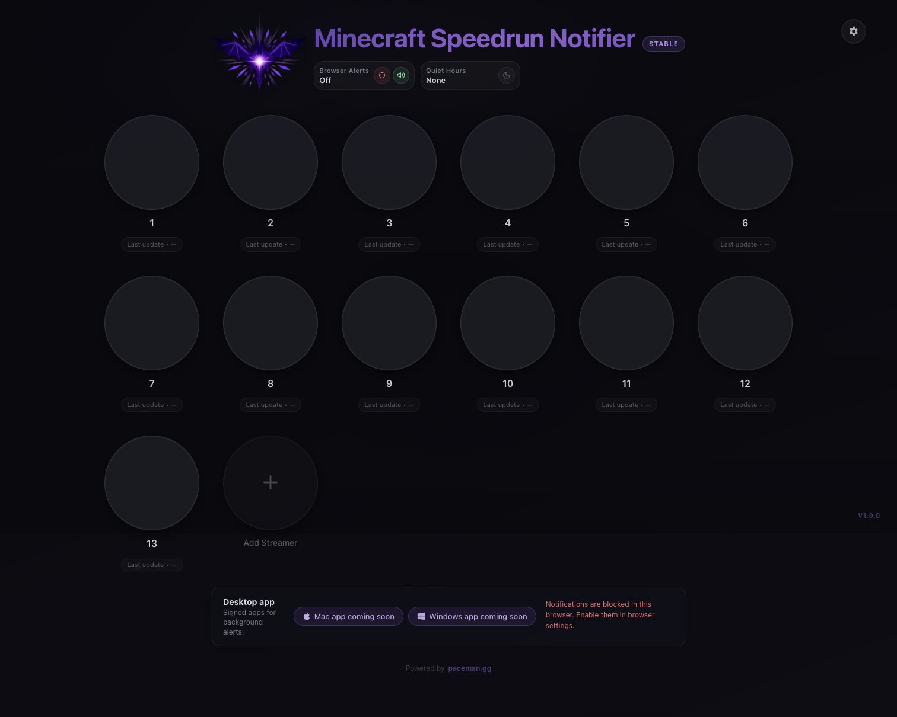
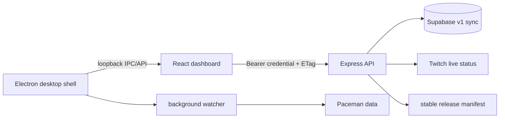

# runAlert

[](https://github.com/jz-42/runAlert/actions/workflows/ci.yml)
[](https://github.com/jz-42/runAlert/releases)
[](LICENSE)

**Know when a Minecraft speedrun becomes worth watching.** runAlert watches live
Paceman run data, applies the milestone thresholds you choose, and sends a local
notification when a tracked runner reaches the interesting part.

[Open runAlert](https://runalert.app) · [Report a bug](https://github.com/jz-42/runAlert/issues/new?template=bug_report.yml) · [Release notes](CHANGELOG.md)



## What v1 includes

- Per-runner milestone alerts with IGT or RTA timing and quiet hours.
- Browser and background desktop monitoring on macOS and Windows.
- Anonymous permanent sync—no email address, profile, or password.
- One-click `runalert://` pairing, with a short-lived manual code as fallback.
- Offline edit queues, explicit conflict resolution, and JSON export/import.
- A universal Apple Silicon/Intel Mac release with signed background updates.
- A Microsoft Store x64 package; the Store manages Windows updates.

The download controls are driven by `GET /api/releases/stable`. They remain
unavailable until a signed artifact or certified Store listing is published, so
the website never advertises an unshipped installer.

## Privacy model

runAlert does not require an account or collect identity data. A new installation
creates a random device credential. The server stores only a hash of that
credential, the alert settings you choose, and timestamps/revisions required for
sync. Permanent credentials never appear in URLs, pairing exchanges expire after
ten minutes and are single-use, and desktop credentials are encrypted with the
operating system through Electron `safeStorage`.

See [Privacy](docs/PRIVACY.md) and [Security](SECURITY.md) for the complete model.

## Architecture



The browser and desktop app share the same revisioned configuration contract.
The Electron renderer is sandboxed and receives only a narrow preload bridge;
the watcher and local API stay in the main-process boundary. More detail is in
[Architecture](docs/ARCHITECTURE.md).

## Local development

Requirements: Node.js **24.17.x**, npm, and the Playwright browsers used by the
end-to-end suite.

```bash
npm run workspace:setup
npx --prefix dashboard playwright install chromium firefox
npm run workspace:run
```

Or run the surfaces separately:

```bash
npm run start:web
npm run dashboard:dev
npm run electron:dev
```

Copy `.env.example` to `.env` for optional Twitch, Supabase, analytics, and
release-manifest configuration. Production sync intentionally fails closed if
Supabase or the credential pepper is missing; it never falls back to an ephemeral
Render filesystem. Apply the clean v1 schema using [Supabase setup](supabase/README.md).

## Quality checks

```bash
npm run test:backend
npm run test:dashboard
npm run lint
npm run dashboard:build
npm run audit:production
npm run test:layout
npm run test:visual
```

CI runs unit/integration tests, linting, a production dependency audit, Chromium
and Firefox layout flows, axe accessibility checks, and deterministic macOS visual
snapshots. Release CI additionally checks version consistency, notarization,
Gatekeeper acceptance, the universal Mac executable, AppX validity, and checksums.

## Releasing

Development lands on `dev`; production ships from `main` through a tested
`dev → main` pull request. A `v*` tag triggers signed Mac and Windows Store
artifacts and publishes the GitHub release after both builds pass. Follow
[Release process](docs/RELEASE.md) and the [owner-device checklist](docs/OWNER_DEVICE_CHECKLIST.md)
before making v1 public.

## Contributing

Bug reports and focused pull requests are welcome. Read [CONTRIBUTING.md](CONTRIBUTING.md)
and follow the [Code of Conduct](CODE_OF_CONDUCT.md). Security issues should use
the private process in [SECURITY.md](SECURITY.md), not a public issue.

## Attribution

runAlert uses public run data provided by [Paceman](https://paceman.gg/) and live
status from Twitch. Minecraft is a trademark of Microsoft. runAlert is an
independent community utility and is not affiliated with, endorsed by, or
sponsored by Mojang Studios, Microsoft, Paceman, Twitch, or tracked creators.

Released under the [MIT License](LICENSE).
